# Luno iOS – Architecture & Folder Structure

This document explains how the **Luno** iOS project is structured, how it is built, and which architectural patterns it follows. It is intended to be readable by both human developers and AI tools that need to navigate and modify the codebase.

---

## 1. High-Level Overview

- **Repository root**
  - Main iOS app source lives under `Luno/`.
  - Xcode project: `Luno.xcodeproj`.
  - Test targets: `LunoTests/` (unit), `LunoUITests/` (UI).

- **Architecture summary**
  The project follows a **Clean Architecture–style layering** combined with **MVVM** and the **Coordinator** pattern:

  | Layer | Folder | Responsibilities |
  |---|---|---|
  | Application | `Application/` | App entry, window setup, DI containers, flow coordinators |
  | Presentation | `Presentation/` | View controllers, views, view models (MVVM) |
  | Infrastructure | `Infrastructure/` | Network client, WebSocket infrastructure |
  | Data | `Data/` | Repository implementations, utilities |
  | Shared | `Observable.swift` | Lightweight reactive primitive used across all layers |

- **Dependency direction**
  ```
  Presentation  →  Domain Interfaces (protocols)
  Data          →  Domain Interfaces (implements them)
  Application   →  All layers (wires everything together)
  Infrastructure        →  No dependency on Presentation/Domain
  ```

---

## 2. Folder Structure

### 2.1 Repository Root

```
iOS_CleanArchitecture/
├── Luno/                    ← Main source code
├── Luno.xcodeproj/
├── LunoTests/
├── LunoUITests/
├── GIIS_iOS_Architecture.md ← (old doc, superseded by this file)
└── README.md
```

### 2.2 `Luno/` – Main Source Tree

```
Luno/
├── Application/             ← Entry point, DI, coordinators
├── Presentation/            ← UI features (MVVM)
├── Infrastructure/          ← Network, WebSocket layers
├── Data/                    ← Repository implementations, utilities
├── Resources/               ← Assets, Info.plist, etc.
└── Observable.swift         ← Shared reactive primitive
```

---

### 2.3 `Application/` – App Entry, Flows, and DI

**Location:** `Luno/Application/`

```
Application/
├── AppDelegate.swift
├── SceneDelegate.swift
├── AppDIContainer.swift
├── AppFlowCoordinator.swift
├── AppConfiguration.swift
├── AppAppearance.swift
├── AppTheme.swift
├── DIContainer/
│   ├── Chat/
│   │   └── ChatDIContainer.swift
│   └── Setting/
│       └── SettingDIContainer.swift
└── Flows/
    ├── Chat/
    │   └── ChatFlowCoordinator.swift
    └── Setting/
        └── SettingFlowCoordinator.swift
```

#### `AppDelegate.swift`
- Marked with `@main`.
- Minimal: sets up the Core Data stack (`NSPersistentContainer`) and handles scene session lifecycle.
- **Window and coordinator setup is done in `SceneDelegate`**, not here.

#### `SceneDelegate.swift`
- Owns the `UIWindow`.
- Creates `AppDIContainer` and `DefaultAppFlowCoordinator`.
- Calls `appFlowCoordinator.start()` to launch the app.
- Saves Core Data context on `sceneDidEnterBackground`.

#### `AppFlowCoordinator.swift`
- **Protocol** `AppFlowCoordinator` defines:
  - `start()` – launches the app.
  - `handlePushNotification(payload:)` – for future notification deep-linking.
  - `logout()` – clears auth and returns to login.
- **Protocol** `AppNavigator` – enables cross-module navigation:
  ```swift
  func navigate(to target: NavigationTarget, navigationController: UINavigationController?)
  ```
- **`DefaultAppFlowCoordinator`** implementation:
  - Stores `childCoordinators` to prevent premature deallocation.
  - `start()` → calls `showMainTabBar()`.
  - `showMainTabBar()` builds a `UITabBarController` with two tabs:
    - **Chat** (tab 0): `message` / `message.fill` SF Symbol
    - **Settings** (tab 1): `gearshape` / `gearshape.fill` SF Symbol
  - Each tab is produced by `makeChatFlow()` and `makeSettingFlow()` respectively.
  - Implements `AppNavigator.navigate(to:)` which dispatches to:
    - `handleChatNavigation(_:navigationController:)`
    - `handleSettingNavigation(_:navigationController:)`

- **Navigation targets:**
  ```swift
  enum ChatNavigationTarget: NavigationTarget {
      case chatList
      case chatDetail(conversationId: String)
  }

  enum SettingNavigationTarget: NavigationTarget {
      case profile
      case theme
  }
  ```

#### `AppDIContainer.swift`
- Application-wide container owning shared infrastructure:
  - `AppConfiguration` (reads `ApiBaseURL` from `Info.plist`).
  - `APIClient` (created from `DefaultNetworkConfig`).
- **Factory methods:**
  - `makeChatDIContainer() → ChatDIContainer`
  - `makeSettingDIContainer() → SettingDIContainer`

#### `AppTheme.swift`
- `AppTheme` enum: `.light`, `.dark`, `.system` with `uiStyle: UIUserInterfaceStyle`.
- `ThemeManager` singleton:
  - `currentTheme: Observable<AppTheme>` – reactive state.
  - `setTheme(_:)` – applies `overrideUserInterfaceStyle` across all windows.

#### `AppConfiguration.swift`
- Reads `ApiBaseURL` from `Info.plist` via `Bundle.main`.
- Fatal error if key is missing (fail-fast at launch).

---

### 2.4 `DIContainer/` – Feature DI Containers

Each DI container follows the same pattern:
1. Declares a `Dependencies` struct (injected by `AppDIContainer`).
2. Provides a factory method for its `FlowCoordinator`.
3. Provides `make*ViewModel` and `make*ViewController` factories.

#### `ChatDIContainer`
```swift
struct Dependencies { let apiClient: APIClient }
```
- `makeChatFlowCoordinator(navigationController:appNavigator:)` → `ChatFlowCoordinator`
- `makeChatListViewController(actions:)` → `ChatListViewController`
- `makeChatDetailViewController(conversationId:actions:)` → `ChatDetailViewController`

#### `SettingDIContainer`
```swift
struct Dependencies { let apiClient: APIClient }
```
- `makeSettingFlowCoordinator(navigationController:appNavigator:)` → `SettingFlowCoordinator`
- `makeSettingRootViewController(actions:)` → `SettingRootViewController`
- `makeProfileViewController(actions:)` → `ProfileViewSettingController`
- `makeThemeViewController(actions:)` → `ThemeSettingViewController`

---

### 2.5 `Flows/` – Feature Coordinators

Each flow coordinator owns a `UINavigationController` and translates typed `NavigationTarget` cases into actual push/present calls.

#### `ChatFlowCoordinator`
- `start()` → navigates to `.chatList`.
- `navigate(to: .chatList)` → sets `ChatListViewController` as root.
- `navigate(to: .chatDetail(conversationId:))` → pushes `ChatDetailViewController`.

#### `SettingFlowCoordinator`
- `start()` → calls `showRoot()` which pushes `SettingRootViewController`.
- `navigate(to: .profile)` → pushes `ProfileViewSettingController`.
- `navigate(to: .theme)` → pushes `ThemeSettingViewController`.

---

### 2.6 `Presentation/` – UI Layer (MVVM)

**Location:** `Luno/Presentation/`

```
Presentation/
├── Chat/
│   ├── ChatList/
│   │   ├── View/   ChatListViewController.swift
│   │   └── ViewModel/   ChatListViewModel.swift
│   └── ChatDetail/
│       ├── View/   ChatDetailViewController.swift
│       └── ViewModel/   ChatDetailViewModel.swift
└── Settings/
    ├── Root/
    │   ├── View/   SettingRootViewController.swift
    │   └── ViewModel/   SettingRootViewModel.swift
    ├── Profile/
    │   ├── View/   ProfileViewSettingController.swift
    │   └── ViewModel/   ProfileSettingViewModel.swift
    └── Theme/
        ├── View/   ThemeSettingViewController.swift
        └── ViewModel/   ThemeSettingViewModel.swift
```

**Common pattern per screen:**

| File | Role |
|---|---|
| `*ViewController.swift` | Owns UI, binds to ViewModel via `Observable` |
| `*ViewModel.swift` | Protocol + `Default*` class; exposes `Observable` state, receives `Actions` struct |
| `*ViewModelActions.swift` | Closures struct injected by coordinator for navigation |

**Settings feature in detail:**

- **`SettingRootViewController`** – `UITableView` with `.insetGrouped` style; data from `[SettingSection]`.
  - `SettingSection` has a `title` header and `[SettingItem]` items.
  - Each `SettingItem` has `title`, `icon`, and `action` closure.

- **`ThemeSettingViewController`** – `UITableView` showing `AppTheme.allCases` rows.
  - Observes `ThemeManager.shared.currentTheme` to auto-reload on external changes.
  - Tap → `ViewModel.didSelectTheme(at:)` → `ThemeManager.shared.setTheme(_:)`.

- **`ThemeSettingViewModel`** – exposes `themeOptions: [AppTheme]` and `currentTheme: AppTheme` (read from `ThemeManager`). No local state needed.

---

### 2.7 `Infrastructure/` – Network & WebSocket

**Location:** `Luno/Infrastructure/`

```
Infrastructure/
├── Network/
│   ├── APIClient.swift       ← Protocol + DefaultAPIClient
│   ├── APIEndpoint.swift     ← Endpoint builder (path, method, body, headers)
│   ├── NetworkConfig.swift   ← Base URL configuration
│   └── NetworkError.swift    ← Typed network error enum
└── WebSocket/               ← (future WebSocket infrastructure)
```

- `APIClient` protocol – async/await or completion-based HTTP requests.
- `DefaultAPIClient` – conforms to `APIClient`, built from `DefaultNetworkConfig(baseURL:)`.
- `APIEndpoint` – value type describing a single API call (path + method + parameters + response type).
- `NetworkError` – typed errors for decoding failures, HTTP errors, connectivity issues, etc.

---

### 2.8 `Data/` – Utilities and Repository Support

**Location:** `Luno/Data/`

```
Data/
└── Utils/
    └── String+JWTParser.swift   ← JWT decode helper
```

- Currently holds shared utilities. Repository implementations will live here as features expand.

---

### 2.9 `Observable.swift` – Reactive Primitive

The project uses a **custom lightweight `Observable<T>`** instead of Combine or RxSwift:

```swift
final class Observable<T> {
    var value: T { didSet { notifyObservers() } }
    
    @discardableResult
    func observe(_ observer: @escaping (T) -> Void) -> UUID
    func remove(identifier: UUID)
}
```

- Fires the observer **immediately on first subscription** (useful for initial UI setup).
- Returns a `UUID` token for unsubscribing.
- Used everywhere: ViewModel → View bindings, `ThemeManager.currentTheme`, etc.

---

## 3. Build & Dependency Management

### 3.1 Xcode Project

- Open `Luno.xcodeproj` in Xcode.
- Build & run on a simulator or device (no CocoaPods/SPM setup required beyond what's in the project file itself).
- Xcode version should support iOS 15+ features (`scrollEdgeAppearance`, `UITabBarAppearance`).

### 3.2 Third-Party Dependencies

- **SnapKit** – auto-layout DSL used in view controllers via `.snp.makeConstraints { }`.
  - Installed via Swift Package Manager (check `Luno.xcodeproj` Package dependencies).
- **No Firebase, no CocoaPods, no RxSwift** – the project intentionally keeps dependencies minimal.

---

## 4. Architecture Patterns and Conventions

### 4.1 Clean Architecture / MVVM / Coordinator

```
┌─────────────────────────────────────┐
│          Application Layer          │
│  SceneDelegate → AppFlowCoordinator │
│  AppDIContainer → Feature DI        │
│  Feature DI → FlowCoordinator       │
└─────────────────┬───────────────────┘
                  │ creates
┌─────────────────▼───────────────────┐
│         Presentation Layer          │
│  ViewController ← ViewModel         │
│  ViewModel uses Actions (closures)  │
│  Actions callbacks → Coordinator    │
└─────────────────┬───────────────────┘
                  │ protocols / use-cases
┌─────────────────▼───────────────────┐
│       Infrastructure / Data         │
│  APIClient, NetworkConfig           │
│  Repository implementations (future)│
└─────────────────────────────────────┘
```

### 4.2 Coordinator Pattern (Navigation)

- Navigation logic is **fully isolated from view controllers**.
- View models receive an `*Actions` struct with closures:
  ```swift
  struct SettingRootViewModelActions {
      let showProfile: () -> Void
      let showTheme: () -> Void
  }
  ```
- Coordinators inject these closures, which call `navigate(to: target)`.
- `AppNavigator` protocol enables **cross-module navigation** without tight coupling.

### 4.3 DI Pattern

- **`AppDIContainer`** owns shared services (`APIClient`, `AppConfiguration`).
- **Feature DI containers** (`ChatDIContainer`, `SettingDIContainer`) are created on-demand with their required `Dependencies`.
- DI containers are the **only place** that `new`s up concrete classes — view controllers, view models, repositories.

### 4.4 Naming Conventions

| Type | Convention | Example |
|---|---|---|
| View Controller | `*ViewController` | `ThemeSettingViewController` |
| ViewModel Protocol | `*ViewModel` | `ThemeSettingViewModel` |
| ViewModel Concrete | `Default*ViewModel` | `DefaultThemeSettingViewModel` |
| ViewModel Actions | `*ViewModelActions` | `ThemeSettingViewModelActions` |
| Flow Coordinator Protocol | `*FlowCoordinator` | `SettingFlowCoordinator` |
| Flow Coordinator Concrete | `Default*FlowCoordinator` | `DefaultSettingFlowCoordinator` |
| DI Container | `*DIContainer` | `SettingDIContainer` |
| Repository Protocol | `*Repository` | (future) `ChatRepository` |
| Repository Concrete | `Default*Repository` | (future) `DefaultChatRepository` |
| Navigation Targets | `*NavigationTarget` enum | `SettingNavigationTarget` |

### 4.5 Theme System

```
AppTheme (enum)   ←→   ThemeManager.shared
     ↑                        ↓
ThemeSettingViewModel    currentTheme: Observable<AppTheme>
     ↑                        ↓
ThemeSettingViewController  .observe { reload tableView }
```

- `ThemeManager` applies `overrideUserInterfaceStyle` to all connected `UIWindow`s.
- `ThemeSettingViewController` observes `ThemeManager.shared.currentTheme` to update the UI reactively.

---

## 5. End-to-End Example: Settings → Theme Selection

### 5.1 Navigation Path

```mermaid
flowchart LR
  scene["SceneDelegate.scene(_:willConnectTo:)"]
  --> appCoor["DefaultAppFlowCoordinator.start()"]
  --> tabBar["showMainTabBar() → UITabBarController"]
  --> settingFlow["DefaultSettingFlowCoordinator.start()"]
  --> settingRoot["SettingRootViewController"]
  --> themeTap["User taps 'Theme'"]
  --> settingCoor["SettingFlowCoordinator.navigate(to: .theme)"]
  --> themeVC["ThemeSettingViewController"]
  --> rowTap["User taps 'Dark Mode'"]
  --> vm["ThemeSettingViewModel.didSelectTheme(at: 1)"]
  --> tm["ThemeManager.shared.setTheme(.dark)"]
  --> window["window.overrideUserInterfaceStyle = .dark"]
```



### 5.2 Step-by-Step

1. **`SceneDelegate`** creates `AppDIContainer` + `DefaultAppFlowCoordinator` and calls `start()`.
2. **`AppFlowCoordinator.showMainTabBar()`** builds a `UITabBarController` with Chat and Settings tabs.
3. **`makeSettingFlow()`** creates `SettingDIContainer` → `DefaultSettingFlowCoordinator` → calls `flow.start()`.
4. **`SettingFlowCoordinator.showRoot()`** creates `SettingRootViewController` with actions:
   - `showTheme` closure → `navigate(to: .theme)`.
5. **`SettingRootViewController`** renders a grouped tableView (`insetGrouped`) with sections from `viewModel.getSections()`.
6. User taps **"Theme"** → `item.action()` → `showTheme()` closure fires.
7. **`SettingFlowCoordinator.navigate(to: .theme)`** calls `diContainer.makeThemeViewController(actions:)` and pushes it.
8. **`ThemeSettingViewController`** shows 3 rows (Light / Dark / System) with the current checkmark driven by `ThemeManager.shared.currentTheme.value`.
9. User taps **"Dark Mode"** → `viewModel.didSelectTheme(at: 1)` → `ThemeManager.shared.setTheme(.dark)`.
10. `ThemeManager` updates `currentTheme.value = .dark`, triggering all observers and applying `.dark` to all windows.
11. The table view observer fires → reloads the section → moves the checkmark to "Dark Mode".

---

## 6. Extending the Project – Adding a New Feature

### 6.1 Checklist

1. **Add navigation target** in `AppFlowCoordinator.swift`:
   ```swift
   enum NewFeatureNavigationTarget: NavigationTarget {
       case root
       case detail(id: String)
   }
   ```

2. **Create `Presentation/NewFeature/`**:
   - `View/NewFeatureViewController.swift`
   - `ViewModel/NewFeatureViewModel.swift` (protocol + `Default*` class)

3. **Create `Application/DIContainer/NewFeature/NewFeatureDIContainer.swift`**:
   - `struct Dependencies` with `apiClient`.
   - `makeFlowCoordinator(...)`, `makeRootViewController(...)`, etc.

4. **Create `Application/Flows/NewFeature/NewFeatureFlowCoordinator.swift`**:
   - `start()` → initial screen.
   - `navigate(to:)` → switch on `NewFeatureNavigationTarget`.

5. **Register in `AppDIContainer`**:
   ```swift
   func makeNewFeatureDIContainer() -> NewFeatureDIContainer {
       NewFeatureDIContainer(dependencies: .init(apiClient: apiClient))
   }
   ```

6. **Register in `AppFlowCoordinator`** (add tab or cross-module route):
   - Add a `makeNewFeatureFlow()` method if it's a tab.
   - Or add a `case let target as NewFeatureNavigationTarget:` branch in `navigate(to:)`.

7. **Follow naming conventions** (see §4.4).

### 6.2 Adding a New Settings Sub-Screen

- Add a case to `SettingNavigationTarget`.
- Add a `make*ViewController` factory in `SettingDIContainer`.
- Add a `navigate(to:)` case in `SettingFlowCoordinator`.
- Add the item to a `SettingSection` in `DefaultSettingRootViewModel.getSections()`.

---

## 7. Notes for AI Tools

- **App entry point**: `SceneDelegate.scene(_:willConnectTo:)` in `Luno/Application/SceneDelegate.swift`.
- **Root coordinator**: `DefaultAppFlowCoordinator` in `Luno/Application/AppFlowCoordinator.swift`.
- **Observable pattern**: All ViewModel → View bindings use `Observable<T>` from `Luno/Observable.swift`. The observer fires **immediately** on subscription.
- **Theme**: `ThemeManager.shared` (singleton in `AppTheme.swift`) is the single source of truth for app appearance.
- **Navigation**: View models never import `UIKit` for navigation. They call closures from their injected `*Actions` struct, which coordinators implement.
- **No Storyboards**: All UI is programmatic using SnapKit for constraints.
- **DI containers are not singletons**: They are created fresh each time by `AppDIContainer` factory methods.
