## GIIS iOS – Architecture & Folder Structure

This document explains how the GIIS iOS project is structured, how it is built, and which architectural patterns it follows. It is written to be readable by both human developers and AI tools that need to navigate and modify the codebase.

---

## 1. High-Level Overview

- **Repository root**
  - Main iOS app lives under `GIIS/`.
  - Dependency management is configured via `GIIS/Podfile`.
  - The Xcode project is `GIIS/GIIS.xcodeproj`.

- **Architecture summary**
  - The project follows a **Clean Architecture–style layering**:
    - `Application/` – app entry point, flow coordinators, and dependency injection (DI) containers.
    - `Presentation/` – UI layer: view controllers, views, view models, styles, and local UI helpers.
    - `Domain/` – business logic: entities, use cases, and repository interfaces.
    - `Data/` – data access: repository implementations, DTOs, networking, and persistence.
  - Within the UI, it uses **MVVM** (Model–View–ViewModel) with **Coordinator** pattern for navigation.
  - Dependencies between layers:
    - `Presentation` → depends on `Domain` (use cases + interfaces).
    - `Domain` → pure business rules/contracts, no dependency back to `Presentation` or `Data`.
    - `Data` → depends on `Domain` (implements domain interfaces) and on networking/persistence infrastructure.

- **Environments and schemes**
  - The Xcode project contains multiple schemes (e.g. `GIIS`, `GIIS Dev`, `GIIS SIT`, `GIIS Staging`) under `GIIS/GIIS.xcodeproj/xcshareddata/xcschemes/`.
  - These map to different backends/configurations (production and various non-production environments).

---

## 2. Folder Structure

### 2.1 Repository Root

- **`GIIS/`**
  - `Podfile`, `Podfile.lock` – CocoaPods configuration for dependencies.
  - Entitlements such as `GIISDebug.entitlements`, `GIIS.entitlements`.
  - Main Xcode project: `GIIS.xcodeproj`.
  - Main source tree in `[GIIS/GIIS](GIIS/GIIS)`.

Everything else in the repo primarily supports this iOS app (Git metadata, tooling configs, etc.).

### 2.2 `Application/` – App Entry, Flows, and DI

Location: `[GIIS/GIIS/Application](GIIS/GIIS/Application)`

**Responsibilities**

- Owns the app entry point and window management.
- Creates and wires **DI containers** for each feature.
- Hosts **flow coordinators** that orchestrate navigation between screens and features.

**Key components**

- **App delegate**
  - File: `[GIIS/GIIS/Application/AppDelegate.swift](GIIS/GIIS/Application/AppDelegate.swift)`
  - Marked with `@main`, conforms to `UIApplicationDelegate`, `UNUserNotificationCenterDelegate`, `MessagingDelegate`.
  - Responsibilities:
    - Creates the `UIWindow` and stores it in `window`.
    - Instantiates `AppDIContainer` and `DefaultAppFlowCoordinator`.
    - Sets up global appearance via `AppAppearance.setupAppearance()`.
    - Handles push notification launch payloads and passes them to `AppFlowCoordinator`.
    - Configures Firebase (`FirebaseApp.configure()`), Firebase Messaging, Google Sign-In (`GIDSignIn`), MSAL, and network debugging (`netfox` in non-RELEASE builds).
    - Applies the persisted **theme** from `userSessionRepository` via `applyTheme(theme:)`.
    - Configures `SDWebImageDownloader.shared.requestModifier` (adds a `Referer` header based on `Config.baseURL`).

- **Root app coordinator**
  - File: `[GIIS/GIIS/Application/AppFlowCoordinator.swift](GIIS/GIIS/Application/AppFlowCoordinator.swift)`
  - Protocol: `AppFlowCoordinator` defines:
    - `start()`, `startAppFlow()`, `reloadTabs(_:)`.
    - Notification-related state (`isLaunchedFromNotification`, `isLaunchedFromGlobalNotification`, `chatId`, `notificationLaunchPayload`).
    - Handlers `handleChatNotification` and `handleGlobalNotifications()`.
  - Implementation: `DefaultAppFlowCoordinator`:
    - Holds `AppDIContainer` and references to socket listeners.
    - Exposes `appWindow` which points to `AppDelegate.window`.
    - **Startup**:
      - `start()` currently calls `showMediaManager()` (a hardcoded entry into the Media Manager module).
      - `startAppFlow()` is the generic app flow:
        - If user token exists:
          - Connects chat and notification sockets (`MessageSocketService`, `NotificationSocketService`, `MainSocketIOProvider`).
          - Listens for unread counts and updates the tab bar.
          - Presents the dashboard tab bar (`showDashboard(...)`).
        - If no token:
          - Presents onboarding (`showOnboardingV2()`).
    - **Dashboard / Tab bar**:
      - `showDashboard(...)` builds a `GIISTempTabBarController` with five tabs (message, email, home, calendar, more).
      - Each tab is produced by helper methods such as:
        - `makeCommunityV2Message()`
        - `makeMailV3()`
        - `makeHome(...)`
        - `makeCommunityV2Calender()`
        - `makeMenu()`
      - Each helper creates a `UINavigationController`, builds a feature-specific DI container, and starts that feature’s flow.
    - **Onboarding**:
      - `showOnboardingV2()` rebuilds `AppDIContainer`, creates an `OnboardingV2` DI container, and pushes login/brand selection according to stored user data.
    - **Media Manager entry**:
      - `showMediaManager()` is a dedicated path into Media Manager:
        - Creates a `MediaManagerDIContainer` via `appDIContainer.makeMediaManagerDIContainer(appNavigator: self)`.
        - Creates a new `UINavigationController`.
        - Uses the DI container to create `MediaManagerFlowCoordinator`.
        - Sets `appWindow?.rootViewController = navVC` and calls `flow.showAddVideo()`.

- **Flows**
  - Located under `[GIIS/GIIS/Application/Flows](GIIS/GIIS/Application/Flows)`.
  - Example: `[GIIS/GIIS/Application/Flows/MediaManager/MediaManagerFlowCoordinator.swift](GIIS/GIIS/Application/Flows/MediaManager/MediaManagerFlowCoordinator.swift)`.
  - Each flow coordinator:
    - Holds a `UINavigationController`.
    - Exposes methods to present feature-specific screens (e.g., `showSchoolVideos`, `showMyMedia`, `showPodcast`, etc.).
    - Bridges from **navigation actions** (closures passed into view models) to actual `pushViewController` / `present` calls.

- **DI Containers**
  - Located under `[GIIS/GIIS/Application/DIContainer](GIIS/GIIS/Application/DIContainer)`.
  - For each feature, there is a DI container responsible for constructing:
    - Repositories (from `Data/` layer).
    - Use cases (from `Domain/` layer).
    - View models (for `Presentation/` layer).
    - Flow coordinators where needed.
  - The `AppDIContainer` owns application-wide services (e.g. `apiDataTransferService`, `userSessionRepository`) and exposes factory functions like `makeMediaManagerDIContainer(appNavigator:)`.

### 2.3 `Presentation/` – UI Layer

Location: `[GIIS/GIIS/Presentation](GIIS/GIIS/Presentation)`

**Responsibilities**

- Contains everything user-facing: view controllers, views, cells, and presentation-specific view models.
- Organized by **feature/module**, each with its own subtree.

**Feature examples**

- `Presentation/MediaManager/...` – Media Manager module with sub-features:
  - `MyMedia`
  - `SchoolVideos`
  - `Podcast`
  - `Drafts`
  - `Moderator`
  - `SharedDrive`
  - `Storage`
  - `CommonViews` (reusable components like bottom sheets, tag pickers, upload overlays, etc.).
- Other major features follow the same layout:
  - `OnboardingV2`, `CommunityV3`, `CommunityV2`, `HRMS`, `VMS`, `Settings`, `Profile`, `TimeTable`, `NotificationV3`, `HelpDesk`, `Todo`, etc.

**Common subfolders per feature**

- `View/` or top-level view files – concrete view controllers and custom views.
- `ViewModel/` – view model types for MVVM.
- `Cells/` – reusable table/collection view cells.
- `CommonViews/` – reusable shared components within the feature.
- `Style/` – style-related helpers, fonts, colors, etc.

**Example: School Videos screen**

- Controller: `[GIIS/GIIS/Presentation/MediaManager/SchoolVideos/View/SchoolVideosViewController.swift](GIIS/GIIS/Presentation/MediaManager/SchoolVideos/View/SchoolVideosViewController.swift)`
  - A `UIViewController` subclass responsible for layout, bindings, and user interactions.
  - Holds a `SchoolVideosViewModel` instance and binds to its `Observable` properties:
    - `isLoading`
    - `error`
    - `filteredList`
  - Uses:
    - A `UICollectionView` for tabs (All / General / Event / Webinars / Highlights).
    - A `UITableView` for displaying `VideoCardConfig` items.
    - Bottom sheets for sorting, options, and share actions.
  - Delegates navigational behavior to the view model via methods like:
    - `viewModel.showSearchScreen()`
    - `viewModel.showMyUploads()`
    - `viewModel.showSchoolVideos(viewMode:)`
    - `viewModel.showMediaStorage()`
    - `viewModel.showVideoDetails(data:)`

- View model: `[GIIS/GIIS/Presentation/MediaManager/SchoolVideos/ViewModel/SchoolVideosViewModel.swift](GIIS/GIIS/Presentation/MediaManager/SchoolVideos/ViewModel/SchoolVideosViewModel.swift)`
  - `DefaultSchoolVideosViewModel` conforms to `SchoolVideosViewModel`.
  - Injected with:
    - `SchoolVideosUseCases` from the Domain layer.
    - `SchoolVideosViewModelActions` struct (closures for navigation).
  - Inputs:
    - Navigation triggers (`showVideoDetails`, `showMediaScreen`, `showAddVideo`, `showMyUploads`, etc.).
    - Data operations (`filterVideos`, `fetchInitialVideos`, `fetchMoreVideos`).
  - Outputs:
    - `Observable<[VideoCardConfig]>` (`filteredList`) for the UI list.
    - `Observable<Bool>` (`isLoading`, `loading`) for UI loading state.
    - `Observable<String>` (`error`) for error messaging.
    - Cursor-based pagination (`nextCursor`) and raw domain `videos` observable.
  - Delegates all data fetching to the domain use case, then maps results to presentation models (`VideoCardConfig`).

### 2.4 `Domain/` – Business Logic

Location: `[GIIS/GIIS/Domain](GIIS/GIIS/Domain)`

**Responsibilities**

- Defines **business entities**, **use cases**, and **repository interfaces**.
- Contains no UIKit or platform-specific UI code.
- Represent the “core” of the app that other layers depend on.

**Subfolders**

- `Entities/` – domain models for business concepts.
  - Example: `Entities/Media Manager/School Videos/...` contains models such as `SchoolVideoItem`, `VideoDetail`, `VideoReaction`, `SubmittedSchoolVideo`, etc.
- `Interfaces/` – abstract contracts for data access.
  - Example: `[GIIS/GIIS/Domain/Interfaces/Media Manager/School Videos/SchoolVideosRepository.swift](GIIS/GIIS/Domain/Interfaces/Media Manager/School Videos/SchoolVideosRepository.swift)` defines methods like:
    - `getSchoolVideos(...)`
    - `getLikedVideos(...)`
    - `getVideoDetail(...)`
    - `getVideoCommentList(...)`
    - `submitSchoolVideo(...)`
- `UseCases/` – orchestrates business logic using repository interfaces.
  - Example: `[GIIS/GIIS/Domain/UseCases/Media Manager/School Videos/SchoolVideosUseCase.swift](GIIS/GIIS/Domain/UseCases/Media Manager/School Videos/SchoolVideosUseCase.swift)`:
    - Protocol `SchoolVideosUseCases` defines a set of operations (get school videos, get liked videos, submit videos, post comments, etc.).
    - `DefaultSchoolVideosUseCases` implementation:
      - Holds `SchoolVideosRepository` and `UserSessionRepository`.
      - Delegates each method directly to the repository, sometimes adding domain-specific defaults (e.g. default limits, optional parameters).

This layer can be reused or tested independently from UI and network.

### 2.5 `Data/` – Data Access, Networking, and Persistence

Location: `[GIIS/GIIS/Data](GIIS/GIIS/Data)`

**Responsibilities**

- Implements domain repository interfaces using:
  - Network layer (HTTP APIs).
  - Local persistent storage (UserDefaults, database, etc.).
  - DTOs and mappers between network and domain models.

**Subfolders**

- `Repositories/`
  - Implements domain interfaces from `Domain/Interfaces`.
  - Example: `[GIIS/GIIS/Data/Repositories/Media Manager/School Videos/DefaultSchoolVideosRepository.swift](GIIS/GIIS/Data/Repositories/Media Manager/School Videos/DefaultSchoolVideosRepository.swift)`:
    - Conforms to `SchoolVideosRepository`.
    - Uses `dataTransferService` to execute HTTP requests constructed by `APIEndpoints`.
    - Adds authentication headers using the current user token from `DefaultUserSessionStorage`.
    - Maps DTOs to domain models via `.toDomain()` functions before returning results to the use case layer.

- `Network/DataMappings/`
  - Contains DTOs and response wrappers.
  - For Media Manager / School Videos, there are DTOs that correspond to API responses for video list, details, comments, reactions, etc.

- `Network/` root
  - Contains `APIEndpoints+Feature.swift` files that define `Endpoint` builders for each feature, including URL path, HTTP method, query parameters, headers, and request/response types.
  - Example: `APIEndpoints+MediaManager.swift` (path names, not shown here) describes endpoints such as:
    - `getSchoolVideos(...)`
    - `getMyUploadedSchoolVideos(...)`
    - `getLikedVideos(...)`
    - `submitSchoolVideo(...)`

- `PersistentStorage/`
  - Implements local persistence such as:
    - `UserSessionStorage` – user token, theme, login data.
    - Other feature-specific cached data and preferences.

### 2.6 `Resources/` – Configuration and Assets

Location: `[GIIS/GIIS/Resources](GIIS/GIIS/Resources)`

- `Info.plist` – main app configuration plist.
- Asset catalogs such as `Assets.xcassets`, including feature-specific groups like `MediaManager` icons and images.
- JSON configuration files (e.g. `CreateCommmunityPopUpLoader.json`, `Country_Codes.json`) used to drive various UI and logic.

---

## 3. Build & Dependency Management

### 3.1 Xcode Project and Schemes

- Open the Xcode project at `[GIIS/GIIS.xcodeproj](GIIS/GIIS.xcodeproj)`.
- Select the desired scheme:
  - `GIIS` – primary production build.
  - `GIIS Dev`, `GIIS SIT`, `GIIS Staging` – environment-specific variants (different API endpoints, configurations, and/or bundle IDs).
- Build and run on a simulator or device from Xcode as usual.

### 3.2 CocoaPods Setup

Configuration file: `[GIIS/Podfile](GIIS/Podfile)`

- Platform and target:
  - `platform :ios, '13.0'`
  - Target: `'GIIS'`.
- Uses dynamic frameworks:
  - `use_frameworks!`
- Core pods:
  - `IQKeyboardManagerSwift` – keyboard management and toolbar behavior.
  - `NVActivityIndicatorView` – activity indicator animations.
  - `Toast-Swift` – toast messages.
  - `SDWebImage` – asynchronous image loading and caching.
- Test targets:
  - `GIISTests` and `GIISUITests` use `inherit! :search_paths` to share pod search paths from the main target.

**Typical install/build flow**

1. From the repository root:
   - `cd GIIS`
2. Install pods:
   - `pod install`
3. Open the generated workspace if present (e.g. `GIIS.xcworkspace`) or continue using `GIIS.xcodeproj` depending on how the project is configured in your environment.
4. In Xcode:
   - Select scheme (`GIIS`, `GIIS Dev`, etc.).
   - Choose device/simulator.
   - Build & run.

### 3.3 Third-Party Services and Libraries

Configured primarily in `[GIIS/GIIS/Application/AppDelegate.swift](GIIS/GIIS/Application/AppDelegate.swift)`:

- **Firebase**
  - Initialized via `FirebaseApp.configure()`.
  - Uses `FirebaseMessaging` for push notifications (FCM).
  - `Messaging.messaging().delegate = self` to receive registration token and message callbacks.

- **Push Notifications**
  - `UNUserNotificationCenter.current().delegate = self`.
  - Requests notification authorization and registers for remote notifications.
  - Saves APNs token (`deviceToken`) and FCM token into `userSessionRepository`.

- **Google Sign-In**
  - `GIDSignIn.sharedInstance.handle(url)` inside `application(_:open:options:)` to support sign-in redirect URLs.

- **MSAL (Microsoft Authentication Library)**
  - `MSALPublicClientApplication.handleMSALResponse` used in the same URL handler to support Microsoft account-based flows.

- **SDWebImage**
  - A custom `requestModifier` adds a `Referer` header with `Config.baseURL` to all download requests for tracking and backend validation.

- **netfox (debug network inspector)**
  - Enabled only in non-`RELEASE` builds (`#if !RELEASE`).

---

## 4. Architecture Patterns and Conventions

### 4.1 Clean Architecture / Layering

- **Presentation layer (`Presentation/`)**
  - Contains views and view models that drive the UI.
  - Talks to `Domain/UseCases` to perform operations.
  - Does not know about networking, DTOs, or storage specifics.

- **Domain layer (`Domain/`)**
  - Defines:
    - `Entities/` – pure data models.
    - `Interfaces/` – repository and service protocols.
    - `UseCases/` – application-specific business rules (orchestrate operations via interfaces).
  - Free of UIKit and concrete networking/storage implementations.

- **Data layer (`Data/`)**
  - Implements domain interfaces using:
    - HTTP APIs (via `dataTransferService` and `APIEndpoints`).
    - Local persistence.
  - Contains mappers to convert between DTOs and domain entities using `.toDomain()` functions.

**Dependency direction**

- `Presentation` → `Domain` (via use case and interface protocols).
- `Domain` → (no outward dependency on `Presentation` or `Data`).
- `Data` → `Domain` (implements interfaces and returns domain entities).
- `Application` orchestrates everything and depends on all other layers to wire them together.

### 4.2 MVVM (Model–View–ViewModel)

**View**

- `UIViewController` or custom views in `Presentation/Feature/.../View`.
- Examples:
  - `SchoolVideosViewController` in `Presentation/MediaManager/SchoolVideos/View/`.
  - `PodcastViewController` in `Presentation/MediaManager/Podcast/View/PodcastViewController.swift`.

**ViewModel**

- Lives in `Presentation/Feature/.../ViewModel`.
- Holds presentation state and exposes observable properties.
- Interacts with domain use cases to fetch/update data.
- Example: `DefaultSchoolVideosViewModel`:
  - Calls `SchoolVideosUseCases.getSchoolVideos(...)` / `getLikedVideos(...)`.
  - Maps `SchoolVideosList` into `[VideoCardConfig]` for display.
  - Exposes `Observable<[VideoCardConfig]>` for the view to observe and reload the table view.

**Model**

- Domain entities like `SchoolVideoItem`, `VideoDetail`, `VideoReaction`, etc. in `Domain/Entities/...`.
- In some cases, presentation models like `VideoCardConfig` that adapt domain entities to UI needs.

### 4.3 Coordinator Pattern

- **App-level coordinator**
  - `DefaultAppFlowCoordinator`:
    - Owns the root window and sets `rootViewController`.
    - Manages the app tab bar and global flows (onboarding, dashboard, notifications, etc.).
    - Implements `AppNavigator` to route between high-level navigation targets.

- **Feature coordinators**
  - Located in `Application/Flows/<Feature>/`.
  - Example: `MediaManagerFlowCoordinator`:
    - Owns a `UINavigationController` for the Media Manager stack.
    - Creates and pushes view controllers for:
      - My Media home.
      - School Videos.
      - Podcast.
      - Drafts.
      - Moderator activity.
      - Storage and shared drive.
    - Connects navigation **actions** from view models to actual `push`/`present` operations.

- **Navigation targets and DI**
  - The `AppNavigator` and per-feature navigation targets (e.g. `MediaManagerNavigationTarget`, `MessagesNavigationTarget`, `NotificationNavigationTarget`) enable type-safe navigation routes.
  - DI containers create flow coordinators, which then navigate based on these targets.

### 4.4 Dependency Injection (DI)

- **AppDIContainer**
  - Shared container for top-level services (API data transfer, user session, etc.).
  - Provides factory methods for feature DI containers (e.g. `makeMediaManagerDIContainer(appNavigator:)`).

- **Feature DI containers**
  - Typically located in `Application/DIContainer/<Feature>/`.
  - Responsibilities:
    - Construct repositories using `Data/Repositories`.
    - Construct use cases with repository interfaces.
    - Construct view models with use cases and `Actions` structs.
    - Provide methods to build flow coordinators and view controllers ready for use.

### 4.5 Naming and Structural Conventions

- **View controllers** – `*ViewController.swift`
- **View models** – `*ViewModel.swift` (often with `Default*ViewModel` concrete class).
- **Use cases** – `*UseCase.swift` or `*UseCases.swift`.
- **Repositories** – interface `*Repository` (in Domain), implementation `Default*Repository` (in Data).
- **Coordinators** – `*FlowCoordinator.swift`.
- **DI containers** – `*DIContainer.swift`.
- **Feature mirroring** – a feature like Media Manager is present across all layers:
  - `Presentation/MediaManager/...`
  - `Domain/Entities/Media Manager/...`, `Domain/Interfaces/Media Manager/...`, `Domain/UseCases/Media Manager/...`
  - `Data/Repositories/Media Manager/...`, `Data/Network/DataMappings/Media Manager/...`
  - `Application/Flows/MediaManager/...`, `Application/DIContainer/MediaManager/...`

---

## 5. End-to-End Example Flow: Media Manager – School Videos

This section walks through how a typical School Videos screen is constructed and how data flows across layers when loading a list of videos.

### 5.1 User Navigation Path

1. **App start**
   - `AppDelegate` sets up the window and creates `DefaultAppFlowCoordinator`.
   - `appFlowCoordinator.start()` is called.
2. **Entry into Media Manager**
   - In the current implementation, `DefaultAppFlowCoordinator.start()` calls `showMediaManager()`.
   - `showMediaManager()`:
     - Creates `MediaManagerDIContainer` from `AppDIContainer`.
     - Creates a `UINavigationController`.
     - Creates `MediaManagerFlowCoordinator` for that navigation controller.
     - Sets the navigation controller as `rootViewController`.
     - Calls `flow.showAddVideo()` (this can be adjusted to start at My Media or School Videos).
3. **Navigating to School Videos**
   - Within `MediaManagerFlowCoordinator`, a method like `showSchoolVideos(viewMode:)`:
     - Builds the `SchoolVideosViewModel` with dependencies and actions.
     - Creates `SchoolVideosViewController(viewModel:)`.
     - Pushes it onto `navigationController`.

### 5.2 Call Chain – Loading School Videos List

The following mermaid diagram shows the high-level call chain for loading the School Videos list:

```mermaid
flowchart LR
  appStart["AppDelegate.didFinishLaunching"] --> appCoord["DefaultAppFlowCoordinator.start"]
  appCoord --> mediaFlow["MediaManagerFlowCoordinator.showSchoolVideos"]
  mediaFlow --> schoolVC["SchoolVideosViewController.viewDidLoad"]
  schoolVC --> schoolVM["DefaultSchoolVideosViewModel.fetchInitialVideos"]
  schoolVM --> schoolUseCase["DefaultSchoolVideosUseCases.getSchoolVideos"]
  schoolUseCase --> schoolRepo["DefaultSchoolVideosRepository.getSchoolVideos"]
  schoolRepo --> mediaApi["APIEndpoints.getSchoolVideos + Network"]
```

**Step-by-step**

- `SchoolVideosViewController.viewDidLoad()`:
  - Calls `viewModel.fetchInitialVideos(limit: 20)`.
  - Sets up bindings to:
    - `viewModel.isLoading` → show/hide loading indicator.
    - `viewModel.error` → present toast messages.
    - `viewModel.filteredList` → reload table view with new data.

- `DefaultSchoolVideosViewModel.fetchInitialVideos(limit:)`:
  - Checks `isLoading` flag to avoid duplicate requests.
  - Decides which API to call based on `viewMode`:
    - `.schoolVideos` → calls `useCase.getSchoolVideos(limit:beforeMediaAssetId:)`.
    - `.likeVideos` → calls `useCase.getLikedVideos(limit:beforeReactionId:)`.
    - `.download` → currently no API; simply ends loading.
  - On completion, maps `SchoolVideosList` to `[VideoCardConfig]` and updates:
    - `videosList`
    - `filteredList` (possibly filtered/sorted by `MediaSortByList`).

- `DefaultSchoolVideosUseCases.getSchoolVideos(...)`:
  - Delegates directly to `SchoolVideosRepository.getSchoolVideos(...)`.

- `DefaultSchoolVideosRepository.getSchoolVideos(...)`:
  - Builds authentication headers using `DefaultUserSessionStorage().fetchUserToken()`.
  - Creates an endpoint using `APIEndpoints.getSchoolVideos(...)`.
  - Uses `dataTransferService.request(with:)` to issue the HTTP request.
  - On success:
    - Converts DTO into domain model via `responseDTO.toDomain()` → `SchoolVideosList`.
    - Calls the completion closure with `.success(domainModel)`.

- `DefaultSchoolVideosViewModel.handleVideosResult(...)`:
  - Updates internal `videosList` and `nextCursor`.
  - Applies optional sorting via `filterVideos(type:)` or sets `filteredList.value = videosList`.
  - The view observes `filteredList` and reloads the table view to show the results.

### 5.3 Pagination and Filtering

- **Pagination**
  - `SchoolVideosViewModel` stores `nextCursor` as an `Observable<String?>`.
  - `fetchMoreVideos(limit:)`:
    - Uses `nextCursor` as `beforeMediaAssetId` or `beforeReactionId` depending on `viewMode`.
    - Appends new items to `videosList` and updates `filteredList`.

- **Filtering**
  - `filterVideos(type:)`:
    - Sorts `videosList` based on criteria such as:
      - Most viewed.
      - Newest/oldest.
      - Title A–Z / Z–A.
      - Shortest/longest duration.
    - Assigns the result to `filteredList`.

---

## 6. Extending the Project – Adding a New Feature

This section provides a generic checklist for adding a new feature that fits the existing architecture.

### 6.1 High-Level Steps

1. **Define domain models and contracts**
   - Add entities under `Domain/Entities/<New Feature>/`.
   - Add repository interfaces under `Domain/Interfaces/<New Feature>/` (e.g. `NewFeatureRepository.swift`).
   - Add use cases under `Domain/UseCases/<New Feature>/` (e.g. `NewFeatureUseCases.swift`).

2. **Implement data access**
   - Create repository implementations under `Data/Repositories/<New Feature>/` (e.g. `DefaultNewFeatureRepository.swift`) that conform to the domain interfaces.
   - Define DTOs and mappings under `Data/Network/DataMappings/<New Feature>/`.
   - Extend or add `APIEndpoints+NewFeature.swift` with endpoint builders.
   - If needed, add persistence hooks under `Data/PersistentStorage/`.

3. **Create presentation layer**
   - Under `Presentation/<New Feature>/`, add:
     - `View/` – `NewFeatureViewController` and related views.
     - `ViewModel/` – `NewFeatureViewModel` and `NewFeatureViewModelActions`.
     - `Cells/`, `CommonViews/`, `Style/` as required.
   - Follow MVVM:
     - View observes `Observable` properties exposed by the view model.
     - View model calls use cases and exposes mapped presentation models.

4. **Wire up DI and navigation**
   - Add a DI container under `Application/DIContainer/<New Feature>/`:
     - Create repositories with `dataTransferService` and storage.
     - Create use cases with the new repository interfaces.
     - Build view models and view controllers.
     - Optionally provide a feature-specific `FlowCoordinator`.
   - Integrate with `AppDIContainer`:
     - Add a factory method like `makeNewFeatureDIContainer(appNavigator:)`.
   - Integrate with `AppFlowCoordinator`:
     - Add a new navigation target (e.g. `NewFeatureNavigationTarget`).
     - Add handler methods to propagate navigation via DI and flow coordinators.
     - Optionally add a new tab or entry point in the menu or existing flows.

5. **Follow naming and structural conventions**
   - Use `*ViewController`, `*ViewModel`, `*UseCases`, `*Repository`, `Default*Repository`, `*FlowCoordinator`, `*DIContainer`.
   - Mirror the feature structure across `Application`, `Presentation`, `Domain`, and `Data`.

### 6.2 Example – Adding Another Media Subfeature

If you were to add a new subfeature under Media Manager:

- **Domain**:
  - `Domain/Entities/Media Manager/NewSubfeature/...`
  - `Domain/Interfaces/Media Manager/NewSubfeature/NewSubfeatureRepository.swift`
  - `Domain/UseCases/Media Manager/NewSubfeature/NewSubfeatureUseCases.swift`

- **Data**:
  - `Data/Repositories/Media Manager/NewSubfeature/DefaultNewSubfeatureRepository.swift`
  - `Data/Network/DataMappings/Media Manager/NewSubfeature/...`
  - Extend `APIEndpoints+MediaManager.swift` with new endpoints.

- **Presentation**:
  - `Presentation/MediaManager/NewSubfeature/View/NewSubfeatureViewController.swift`
  - `Presentation/MediaManager/NewSubfeature/ViewModel/NewSubfeatureViewModel.swift`
  - Shared `CommonViews` if needed.

- **Application**:
  - Extend `MediaManagerDIContainer` to construct the new view model and view controller.
  - Extend `MediaManagerFlowCoordinator` with a new method `showNewSubfeature(...)` and wire it to `NewSubfeatureViewModelActions`.

---

## 7. Notes for AI Tools Consuming This Project

- **Locating main entry points**
  - App start: `AppDelegate` in `GIIS/GIIS/Application/AppDelegate.swift`.
  - Root coordinator: `DefaultAppFlowCoordinator` in `GIIS/GIIS/Application/AppFlowCoordinator.swift`.
  - Media Manager flow: `MediaManagerFlowCoordinator` in `GIIS/GIIS/Application/Flows/MediaManager/MediaManagerFlowCoordinator.swift`.

- **Finding feature modules**
  - Search for a feature name (e.g. `MediaManager`, `OnboardingV2`, `NotificationV3`) and then:
    - Look in `Presentation/<Feature>/` for views and view models.
    - Look in `Domain/UseCases/<Feature>/` and `Domain/Interfaces/<Feature>/` for business logic.
    - Look in `Data/Repositories/<Feature>/` and `Data/Network/DataMappings/<Feature>/` for repositories and DTOs.
    - Look in `Application/Flows/<Feature>/` and `Application/DIContainer/<Feature>/` for coordinators and DI wiring.

- **Understanding navigation**
  - View models usually receive an `Actions` struct (e.g. `SchoolVideosViewModelActions`) that contains closures which call into coordinators.
  - Coordinators then own the `UINavigationController` and perform actual pushes/presents.

- **Safe modification tips**
  - When adding new API calls:
    - Add/extend DTOs in `Data/Network/DataMappings`.
    - Add endpoints to `APIEndpoints+Feature.swift`.
    - Extend the relevant repository and use case, then update the view model.
  - When adding UI changes:
    - Keep business logic inside view models/use cases.
    - Use the existing `Observable` pattern for exposing state to views.

This structure is consistent across most features, so once you understand one (like Media Manager → School Videos), you can apply the same patterns to the rest of the app.

